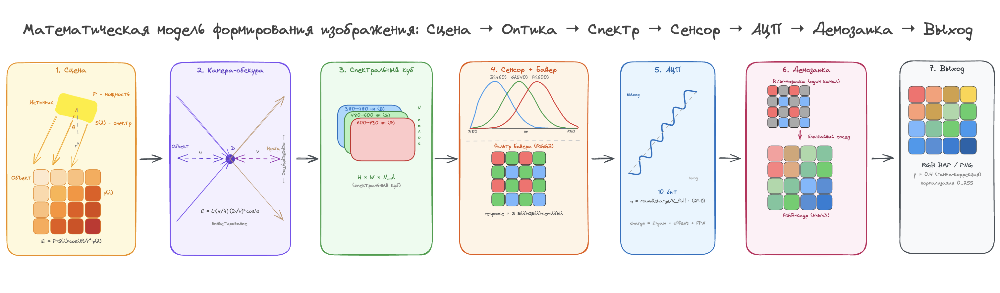

# Симуляция системы формирования изображения

Математическая модель полного пайплайна камеры: от источника света до итогового RGB-кадра.



## Пайплайн

### 1. Сцена

Точечный источник света с заданной мощностью (Вт) и спектром излучения (Вт/м²/нм) освещает плоский объект. Облучённость каждой точки объекта вычисляется по закону обратных квадратов с учётом угла падения:

```
E = P · cos(θ) / r² · spectrum · reflectance
```

Объект задаётся коэффициентами спектрального отражения (reflectance) по длинам волн 380–730 нм.

### 2. Камера-обскура

Геометрическая проекция сцены через точечную диафрагму на плоскость изображения. Учитывается виньетирование по радиометрической формуле (закон cos⁴):

```
E_image = L · (π/4) · (D/v)² · cos⁴(α)
```

где `D` — диаметр диафрагмы, `v` — расстояние диафрагма → изображение, `α` — угол между лучом и оптической осью.

### 3. Спектральный куб

Результат проекции — трёхмерный массив `H × W × bands`, где каждый пиксель содержит спектральное распределение облучённости.

### 4. Сенсор + мозаика Байера

Спектральный куб свёртывается с кривыми чувствительности RGB-каналов (гауссовы пики: B≈460 нм, G≈540 нм, R≈600 нм). Результат накладывается на мозаику Байера, после чего вычисляется накопленный заряд:

```
charge = irradiance · gain + dark_offset + FPN
```

### 5. АЦП

Аналоговый сигнал квантуется в цифровой код:

```
code = clamp(charge / full_scale) · (2ⁿ − 1)
```

где `n` — разрядность АЦП (8–16 бит).

### 6. Демозаика

RAW-мозаика восстанавливается в полноцветный RGB-кадр методом ближайшего соседа.

### 7. Выход

Итоговый RGB-кадр с возможностью автонормализации (min-max stretch) или отображения физических значений АЦП.

---

## Стек технологий

| Слой | Инструмент |
|---|---|
| Симуляция | NumPy, Python |
| Графики | Matplotlib, Plotly |
| GUI + визуализация | Streamlit |
| Данные | Pandas |

### Архитектура

```
Python Backend (workspace/) ←→ Streamlit (streamlit_app/app.py)
```

### Запуск

```bash
source .venv/bin/activate
streamlit run streamlit_app/app.py
```
